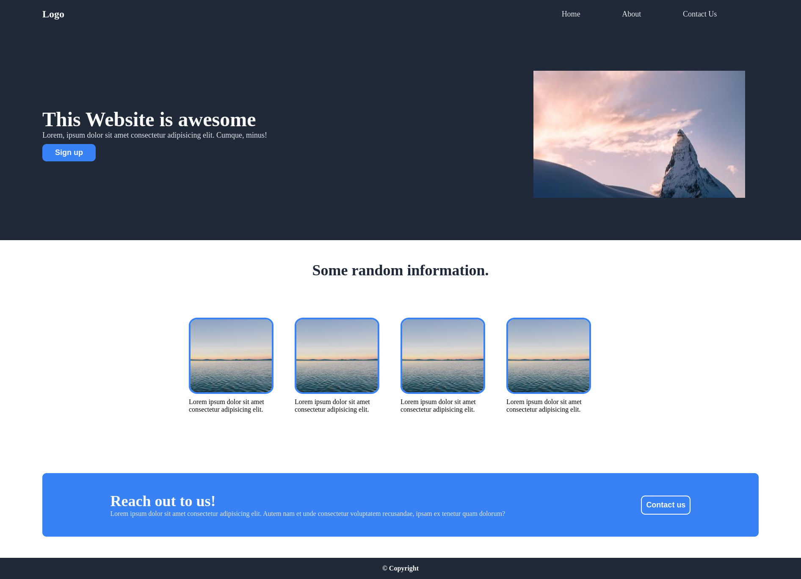

# Landing Page

Create a simple landing page using CSS flexbox.

You're free to change the theme, add new colors, photos etc... .

The main objective here is to get the same layout as the design using flexbox, it doesn't have to be pixel perfect.

### Example

### Check List

- The `logo` in the Navigation section is **2 times** larger than the `link-wrapper` .

- In the Hero section, the `hero-text` is **2 times** larger than the `hero-image-wrapper`.

- In the Information section, the images will **wrap** when they don't have enough space.

- All the buttons have rounded corners.

- The images in the Information section have rounded corners.
